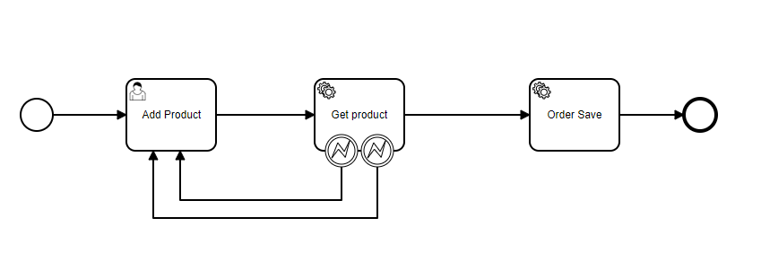
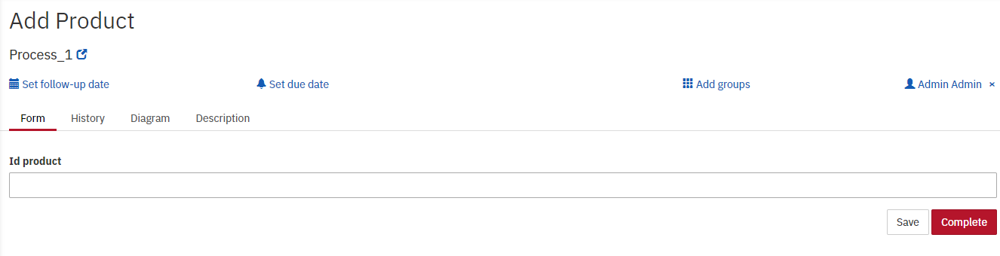

Бизнес процесс добавления продуктов в корзину, пользователь выбирает товар.
Информация о нем запрашивается из сервиса флакс далее передается по ресту для добавления в корзину.
При возникновении ошибок пользователь возвращется на этап выбора товара.

Форма передает id товара, по которому будет осуществляться поиск.
